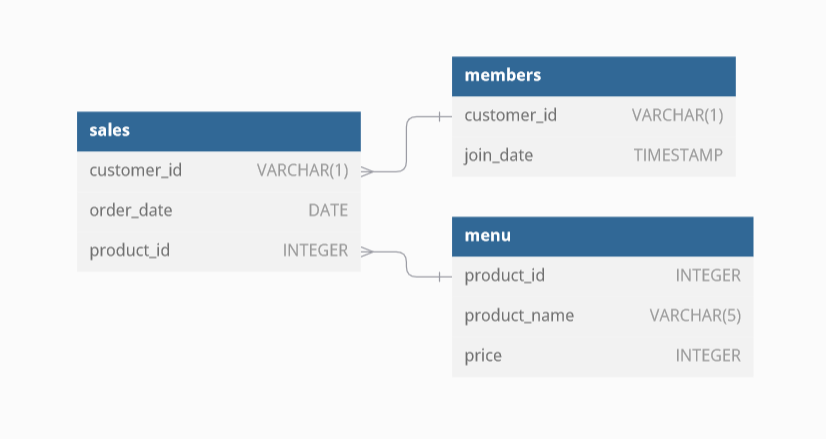

# 👨🏻‍🍳 Case Study #1: Danny's Diner


***

## 📖 Table of Contents
1. [Bussiness Task](#bussiness-task)
2. [Entity Relationship Diagram](#entity-relationship-diagram)
3. [Analysis Questions](#analysis-questions)
4. [Bonus Questions](#bonus-questions)


Please note that all the information regarding the case study has been sourced from the following link: [here](https://8weeksqlchallenge.com/case-study-1/).

***

## Bussiness Task
Danny wants to use the data to answer a few simple questions about his customers, especially about their visiting patterns, how much money they’ve spent and also which menu items are their favourite. Having this deeper connection with his customers will help him deliver a better and more personalised experience for his loyal customers.

***

## Entity Relationship Diagram



***

## Analysis Questions

Please feel free to check the solutions in the [Db Finder](https://www.db-fiddle.com/f/2rM8RAnq7h5LLDTzZiRWcd/138). The solutions provided here are run on PostgresSQL v13. With that being said, let's delve into it!

**1. What is the total amount each customer spent at the restaurant?**

````sql
SELECT s.customer_id, SUM(m.price) total_sales
FROM dannys_diner.sales s
INNER JOIN dannys_diner.menu m
ON s.product_id = m.product_id
GROUP BY s.customer_id
ORDER BY total_sales DESC;
````

### Steps
- Use **JOIN** to merge `dannys_diner.sales` with alias s and `dannys_diner.menu` with alias s tables as `sales.customer_id` and `menu.price` are from both tables.
- Use the aggregate function **SUM** to calculate the total sales contributed by each customer.
- Group the aggregated results by `sales.customer_id`. 

### Answer
| customer_id | total_sales |
| ----------- | ----------- |
| A           | 76          |
| B           | 74          |
| C           | 36          |

- Customer A spent $76.
- Customer B spent $74.
- Customer C spent $36.

***

2. How many days has each customer visited the restaurant?

````sql
SELECT s.customer_id, COUNT(DISTINCT order_date) total_visits
FROM dannys_diner.sales s
GROUP BY s.customer_id
ORDER BY total_visits DESC;
````

### Steps
- Use the aggregate function **COUNT** and the function **DISTINCT** to count the different dates each costumer has visited the diner.
- Group the aggregated results by `sales.customer_id`. 
- Order the aggregated results in **DESC** by total_visits to have the clientes by how many times they have visited the store. 

### Answer
| customer_id | total_sales |
| ----------- | ----------- |
| B           | 6           |
| A           | 4           |
| C           | 2           |

- Customer A has visited 4 times.
- Customer B has visited 6 times.
- Customer C has visited 2 times.

***

**3. What was the first item from the menu purchased by each customer?**

````sql
WITH ordered_sales AS (
    SELECT 
        s.customer_id,
        s.order_date, 
        m.product_name,
        DENSE_RANK() OVER (
            PARTITION BY s.customer_id --, s.order_date 
            ORDER BY s.order_date
        ) AS o_rank
    FROM dannys_diner.sales s
  	LEFT JOIN dannys_diner.menu m
  	ON s.product_id = m.product_id
)
SELECT customer_id,product_name
FROM ordered_sales
WHERE o_rank = 1
GROUP BY customer_id, product_name
ORDER BY customer_id;
````

### Steps
- Create a Common Table Expression (CTE) named `ordered_sales`. Within the CTE, create a new column named `o_rank` using **DENSE_RANK** over partitions by `dannys_diner.customer_id` and use a **LEFT JOIN** with `dannys_diner.menu` to get the `product_name`.
- Use **GROUP BY** with `customer_id` and `product_name`.
- Use **WHERE** to only display the results with `o_rank` as 1. 

**NOTE**

If needed decomment order_date to get the first items bough on each visit.

### Answer
| customer_id | total_sales |
| ----------- | ----------- |
| A           | curry       |
| A           | sushi       |
| B           | curry       |
| C           | ramen       |

- Customer A first ordered curry and suchi simultinously.
- Customer B first ordered curry
- Customer C first ordered ramen.

***

**4. What is the most purchased item on the menu and how many times was it purchased by all customers?**

````sql
SELECT  
	m.product_name, 
	COUNT(*) most_purchased
FROM dannys_diner.sales s
LEFT JOIN dannys_diner.menu m
	ON s.product_id = m.product_id
GROUP BY m.product_name
ORDER BY most_purchased DESC
LIMIT 1;
````

### Steps
- Use **LEFT JOIN** with `dannys_diner.sales` and `dannys_diner.menu` to get `menu.product_name`.
- Use the aggregate function **COUNT** on `menu.product_name`.
- Order the agregated results by the **COUNT** and only display the first element with **LIMIT** 1 .

### Answer
| product_name | most_purchased |
| ------------ | -------------- |
| ramen        | 8              |

- Ramen is the most purchased item (8 purchases).

***

**5. Which item was the most popular for each customer?**

````sql
WITH count_per_customer AS (
    SELECT 
        s.customer_id, 
        m.product_name, 
        COUNT(m.product_id) AS total_count,
  		DENSE_RANK() OVER (
          PARTITION BY s.customer_id
                          ORDER BY COUNT(s.customer_id) DESC) rank
  	FROM dannys_diner.sales s
    LEFT JOIN dannys_diner.menu m
        ON s.product_id = m.product_id
    GROUP BY s.customer_id, m.product_name
)
SELECT customer_id,
	   product_name,
	   total_count
FROM count_per_customer
WHERE rank = 1;
````

### Steps
- Create a Common Table Expresion (CTE) named `count_per_customer`. Create a new column called `rank` with **DENSE_RANK** over **PARTITION BY** on `sales.customer_id` with **ORDER BY** by **COUNT** the customer_id **DESC** agrouping `sales.customer_id` and `menu.product_name`
    -  Use **LEFT JOIN** on `dannys_diner.sales` and `dannys_diner.menu` within `count_per_customer` CTE.
- Select `customer_id` , `product_name` and `total_count` only with `rank` is equal to 1.

### Answer
| customer_id | product_name | total_count |
| ----------- | ------------ | ----------- |
| A           | ramen        | 3           |
| B           | ramen        | 2           |
| B           | curry        | 2           |
| B           | sushi        | 2           |
| C           | ramen        | 3           |

- Customer A has bought ramen the most (3 times).
- Customer B has bought ramen, curry and sushi the most equally (2 times).
- Customer C has bought ramen the most (3 times).

***

**6. Which item was purchased first by the customer after they became a member?**

````sql
WITH first_item_after_member AS (
  SELECT m.customer_id, 
         me.product_name,
         DENSE_RANK() OVER (PARTITION BY m.customer_id 
                            ORDER BY s.order_date ASC) rank
  FROM dannys_diner.members m
  RIGHT JOIN dannys_diner.sales s
     ON m.customer_id = s.customer_id
  LEFT JOIN dannys_diner.menu me
  	 ON s.product_id = me.product_id
  WHERE s.order_date >= m.join_date
  ORDER BY m.customer_id, s.order_date)
  SELECT customer_id, 
         product_name 
  FROM first_item_after_member
  WHERE rank = 1;
````

### Steps
- Create a Common Table Expression (CTE) named `first_time_after_member` joining the tables `dannes_diner.sales`, `dannes_diner.menu` and `dannes_diner.members`.    
    - Using **DENSE_RANK** over **PARTITION BY** `members.customer_id` and ordering it by `sales.order_date`. 
    - Use **WHERE** `sales.order_date` is less or equal to `members.join_date`
- Select `customer_id` and `product_name` from the CTE created with `rank` is equal to 1.

### Answer
| customer_id | product_name |
| ----------- | ------------ |
| A           | curry        |
| B           | sushi        |

- Customer A ordered curry first as a member.
- Customer B ordered sushi first as a member.
- Customer C is not a member so they don't appear.

***

**7. Which item was purchased just before the customer became a member?**

````sql
WITH last_item_before_member AS (
  SELECT m.customer_id, 
  		 s.order_date,
         me.product_name,
         ROW_NUMBER() OVER (PARTITION BY m.customer_id 
                            ORDER BY s.order_date DESC) rank
  FROM dannys_diner.members m
  INNER JOIN dannys_diner.sales s
     ON m.customer_id = s.customer_id
  LEFT JOIN dannys_diner.menu me
  	 ON s.product_id = me.product_id
  WHERE s.order_date < m.join_date
  ORDER BY m.customer_id, s.order_date)
  SELECT customer_id,
         product_name 
  FROM last_item_before_member
  WHERE rank = 1;
````

### Steps
- Create a Common Table Expression (CTE) named `last_item_before_member` joining three tables `dannys_diner.sales`, `dannys_diner.menu` and `dannys_diner.sales`.
        - Create a new column called `rank` **ROW_NUMBER** over **PARTITION BY** `members.customer_id` ordering them by `sales.order_date`.
        - Use **WHERE** to only get the orders before the customers became members.
- Select the `customer_id`, `product_name` where `rank` is equal to 1.

**NOTE**

We use **ROW_NUMBER** instead of **RANK** or **DENSE_RANK** because we are only interested in the very last record. We don't care about items above the last one. 

**RANK** AND **DENSE_RANK** rank over a determined order given, allowing multiple to rows to chare rank whereas **ROW_NUMBER** assigns a different number regardless.

### Answer
| customer_id | product_name |
| ----------- | ------------ |
| A           | sushi        |
| B           | sushi        |

- Customer A bought sushi at last before becoming a member.
- Customer B bought sushi at last before becoming a member.
- Customer C is not a member so they don't appear.

***

**8. What is the total items and amount spent for each member before they became a member?**

````sql
SELECT m.customer_id, 
       COUNT(s.product_id) product_count,
       SUM(me.price) total_amount_spend
FROM dannys_diner.members m
LEFT JOIN dannys_diner.sales s
ON s.customer_id = m.customer_id 
INNER JOIN dannys_diner.menu me
ON s.product_id = me.product_id
WHERE s.order_date < m.join_date
GROUP BY m.customer_id
ORDER BY m.customer_id;
````

### Steps
- Join the three tables `dannys_diner.sales`, `dannys_diner.menu` and `dannys_diner.members` to get all the data necessary and filter with **WHERE** all the `sales.order_sales` before the members joined. 
- Use the **COUNT** function to get all the products bought.
- USE **SUM** function to sum the prices of each order bought.
- Use **GROUP BY** `members.customer_id` and **ORDER BY** `members.customer_id` to display the results.

### Answer
| customer_id | product_count | total_amount_spent |
| ----------- | ------------- | ------------------ |
| A           | 2             | 25                 |
| B           | 3             | 40                 |

- Customer A bought 2 products and spent 25 before becoming a member.
- Customer B bought 3 products and spent 40 before becoming a member.
- Customer C is not a member.

***

**9. If each $1 spent equates to 10 points and sushi has a 2x points multiplier - how many points would each customer have?**

````sql
SELECT s.customer_id,
	  SUM(CASE
           WHEN me.product_name = 'sushi' THEN me.price * 2
           ELSE me.price
       END) * 10 total_points
FROM dannys_diner.sales s
LEFT JOIN dannys_diner.menu me
ON s.product_id = me.product_id
GROUP BY s.customer_id
ORDER BY s.customer_id;
````

### Steps
- Join the tables `dannys_diner.menu` and `dannys_diner.sales` to get all the necessary data.
- Use  **CASE**  if `menu.product_name` is equal to 'sushi' double the price. 
- Create a new column called `total_points` using the **SUM** function to all the `menu.price` and multiply by 10.
- Agroup by `sales.customer_id` and order by the same field to display the result.

### Answer
| customer_id | total_points |
| ----------- | ------------ |
| A           | 860          |
| B           | 940          |
| C           | 360          |

- Customer A has accumulated 860 points out of all their purchases.
- Customer B has accumulated 940 points out of all their purchases.
- Customer C has accumulated 360 points out of all their purchases.

***

**10. In the first week after a customer joins the program (including their join date) they earn 2x points on all items, not just sushi - how many points do customer A and B have at the end of January?**

````sql

````

### Steps


### Answer


***

## Bonus Questions

**Join All Things**

It should show the customer_id, order_date, product_name and display a 'Y' if the order was made by a a member else 'N'.

````sql
SELECT s.customer_id,
		s.order_date::DATE,
        menu.product_name,
        menu.price,
        CASE
        	WHEN m.customer_id IS NOT NULL AND s.order_date >= m.join_date THEN 'Y'
            ELSE 'N'
        END AS member
 FROM dannys_diner.sales s
  LEFT JOIN dannys_diner.members m
  ON s.customer_id = m.customer_id
 LEFT JOIN dannys_diner.menu menu
 ON s.product_id = menu.product_id
 ORDER BY s.customer_id, s.order_date;
````

### Steps

### Answer

customer_id	|        order_date        |  product_name  | price | member |
 ---------- | ------------------------ | -------------- | ----- | ------ |
A	        | 2021-01-01T00:00:00.000Z | sushi          | 10    | N      |
A	        | 2021-01-01T00:00:00.000Z | curry          | 15    | N      |
A	        | 2021-01-07T00:00:00.000Z | curry          | 15    | Y      |
A	        | 2021-01-10T00:00:00.000Z | ramen          | 12    | Y      |
A	        | 2021-01-11T00:00:00.000Z | ramen          | 12    | Y      |
A 	        | 2021-01-11T00:00:00.000Z | ramen          | 12	| Y      |
B	        | 2021-01-01T00:00:00.000Z | curry          | 15	| N      |
B	        | 2021-01-02T00:00:00.000Z | curry          | 15	| N      |
B	        | 2021-01-04T00:00:00.000Z | sushi          | 10	| N      |
B	        | 2021-01-11T00:00:00.000Z | sushi          | 10	| Y      |
B	        | 2021-01-16T00:00:00.000Z | ramen          | 12	| Y      |
B	        | 2021-02-01T00:00:00.000Z | ramen          | 12	| Y      |
C	        | 2021-01-01T00:00:00.000Z | ramen          | 12	| N      |
C	        | 2021-01-01T00:00:00.000Z | ramen          | 12	| N      |
C	        | 2021-01-07T00:00:00.000Z | ramen          | 12	| N      |


**Rank All The Things**

Danny also requires further information about the ranking of customer products, but he purposely does not need the ranking for non-member purchases so he expects null ranking values for the records when customers are not yet part of the loyalty program.

````sql

````

### Steps

### Answer
