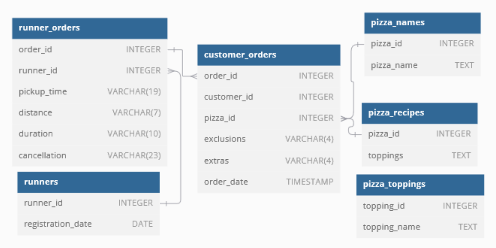

# 🍕 Case Study #2: Pizza Runner
[](https://github.com/KarenSaraiMoralesMontiel/8-Week-SQL-Challenge/tree/main)
[](https://github.com/KarenSaraiMoralesMontiel/Portfolio)


***

## 📖 Table of Contents
1. [Bussiness Task](#bussiness-task)
2. [Entity Relationship Diagram](#entity-relationship-diagram)
3. [Data Cleaning](#data-cleaning)
4. [Solution](#solutions)
	- [A. Pizza Metrics](#a-pizza-metrics)
	- [B. Runner and Customer Experience](#b-runner-and-customer-experience)
	- [C. Ingredient Optimisation](#c-ingredient-optimisation)

Please note that all the information regarding the case study has been sourced from the following link: [here](https://8weeksqlchallenge.com/case-study-2/).

***

## Bussiness Task
Danny was scrolling through his Instagram feed when something really caught his eye - “80s Retro Styling and Pizza Is The Future!”

Danny was sold on the idea, but he knew that pizza alone was not going to help him get seed funding to expand his new Pizza Empire - so he had one more genius idea to combine with it - he was going to Uberize it - and so Pizza Runner was launched!

***

## Entitity Relationship Diagram


***

## 🧼 Data Cleaning
[](#-table-of-contents)

### 🛠 Customer Orders

This is the `pizza_runner.customer_orders` table. As we can see the columns `customer_orders.exclusions` and  `customer_orders.extras` present irregularations in their data wich will cause our analysis to be less accurate.

order_id |	customer_id	|pizza_id	|exclusions	|extras	|order_time|
 ------- | -------------| --------- | --------- | ------| -------- |
1 |	101|	1	|	| |	01/01/2020 18:05
2|	101	|1	||		|01/01/2020 19:00
3|	102	|1	||		|02/01/2020 23:51
3|	102	|2	|	|NULL	|02/01/2020 23:51
4|	103	|1	|4	|	|04/01/2020 13:23
4|	103	|1	|4	|	|04/01/2020 13:23
4|	103	|2	|4	|	|04/01/2020 13:23
5|	104	|1	|null|	1	|08/01/2020 21:00
6|	101	|2	|null|	null	|08/01/2020 21:03
7|	105	|2	|null	|1	|08/01/2020 21:20
8|	102	|1|	null	|null	|09/01/2020 23:54
9|	103	|1|	4|	1, 5	|10/01/2020 11:22
10|	104	|1|	null	|null	|11/01/2020 18:34
10|	104|	1	|2, 6	|1, 4	|11/01/2020 18:34

The columns are plagued with **NULL** values, empty strings '' and 'null' strings. we can also see that multiple ponts are in the exclusions and extras.
First we create a tempt table to handle the missing values before creating the new descriptive tables.

````sql
CREATE TEMP TABLE temp_customer_orders AS 
SELECT
	order_id,
	customer_id, pizza_id,
		CASE 
    -- return empty string if there were no exclusions
    WHEN exclusions IS NULL OR TRIM(exclusions) LIKE 'null' THEN NULL
    WHEN exclusions = '' THEN NULL
    ELSE TRIM(exclusions)
END AS exclusions,

	CASE
        -- return empty string if there were no extras added
		WHEN extras IS NULL or TRIM(extras) LIKE 'null' THEN  NULL
        WHEN extras = '' THEN NULL
	  	ELSE TRIM(extras)
	 END AS extras,
	order_time
FROM pizza_runner.customer_orders;
````

#### Output
|order_id|	customer_id	|pizza_id|	exclusions	|extras	|order_time|
| ------ | ------------ | ------ | ------------ | ----- | -------- | 
|1	|101|	1|NULL	|NULL	|	01/01/2020 18:05 |
|2	|101|	1|NULL	|NULL	|	01/01/2020 19:00|
|3	|102|	1|NULL	|NULL	|	02/01/2020 23:51|
|3	|102|	2|NULL	|NULL	|	02/01/2020 23:51|
|4	|103|	1|	4|NULL	|	04/01/2020 13:23|
|4	|103|	1|	4|NULL	|	04/01/2020 13:23|
|4	|103|	2|	4|NULL	|	04/01/2020 13:23|
|5	|104|	1|NULL	 |	1	|08/01/2020 21:00|
|6	|101|	2|	 NULL|	NULL	|08/01/2020 21:03|
|7	|105|	2|	NULL |	1	|08/01/2020 21:20|
|8	|102|	1|	NULL |	NULL	|09/01/2020 23:54|
|9	|103|	1|	4|	1, 5|	10/01/2020 11:22 |
|10	|104|	1|NULL	 |	NULL	|11/01/2020 18:34| 
|10	|104|	1|	2, 6|	1, 4	|11/01/2020 18:34|

***

### 🛠 Runner Orders

This is the `pizza_runner.runner_orders` table. As we can see the columns `runner_orders.pickup_time`,  `runner_orders.distance` , `runner_orders.duration` and `runner_orders.cancellation` present irregularations in their data wich will cause our analysis to be less accurate.

|order_id|	runner_id|	pickup_time	|distance|	duration|	cancellation|
| ------| ---------- | ------------ | ------ | -------- | ------------- |
|1|	1|	01/01/2020 18:15 |	20km|	32 minutes	| |
|2|	1|	01/01/2020 19:10 |	20km|	27 minutes	|
|3|	1|	03/01/2020 00:12 |	13.4km|	20 mins	|NULL|
|4|	2|	04/01/2020 13:53  |	23.4|	40|	NULL|
|5|	3|	08/01/2020 21:10 |	10|	15	|NULL|
|6|	3|	null|	null |	null|	Restaurant Cancellation|
|7|	2|	08/01/2020 21:30	|25km|	25mins	|null|
|8|	2|	10/01/2020 00:15	|23.4 km|	15 minute|	null |
|9|	2|	null|	null|	null|	Customer Cancellation |
|10|	1|	11/01/2020 18:50|	10km|	10minutes|	null|

We create a temporary table and clean the used data.

````sql
CREATE TEMP TABLE temp_runner_orders AS 
SELECT 
	order_id,
	runner_id,
	CASE
        -- Impute with null values
		WHEN pickup_time is NULL THEN NULL
		WHEN pickup_time = 'null' THEN NULL
		ELSE TRIM(pickup_time)
	END AS pickup_time,
	CASE
        -- Impute with null values
		WHEN distance is NULL THEN NULL
		WHEN distance = 'null' THEN NULL
		WHEN distance LIKE '%km' THEN TRIM('km' from distance)
		ELSE TRIM(distance)
	END AS distance,
	CASE 
        -- Impute with null values
		WHEN duration IS NULL THEN NULL
		WHEN duration = 'null' THEN NULL
		WHEN duration LIKE '%min%' THEN SPLIT_PART(duration, 'min', 1)
        ELSE TRIM(duration)
	END AS duration,
	CASE 
        -- Impute with null values
		WHEN cancellation LIKE '' THEN NULL
		WHEN cancellation IS NULL THEN NULL
		WHEN cancellation = 'null' THEN NULL
		ELSE TRIM(cancellation)
	END AS cancellation
FROM pizza_runner.runner_orders;
````

Then alter the table type.

````sql 
ALTER TABLE temp_runner_orders
ALTER COLUMN pickup_time TYPE TIMESTAMP USING pickup_time::timestamp,
ALTER COLUMN distance TYPE FLOAT USING distance::float,
ALTER COLUMN duration TYPE INT USING duration::int;

````
#### Output
|order_id|	runner_id	|pickup_time	|distance | duration |cancellation|
| ------ | ------------ | ------------- | --------| ------- | ---------- |
|1	|1	|01/01/2020|	20|	32|	NULL|
|2	|1	|01/01/2020|	20|	27|	NULL|
|3	|1	|03/01/2020|	13.4|	20|	NULL|
|4	|2	|04/01/2020|	23.4|	40|	NULL|
|5	|3	|08/01/2020|	10	|15	|NULL|
|6	|3	|NULL|	NULL|	NULL	|Restaurant Cancellation|
|7	|2	|08/01/2020|	25|	25	   |NULL|
|8	|2	|10/01/2020|	23.4|	15	|NULL|
|9	|2	|NULL	|NULL|	NULL	|Customer Cancellation|
|10|	1|	11/01/2020	|10|	10|	NULL|

Now we are all set to use this temporary tables to answer the solutions from this case study!

***

## Solutions

## A. Pizza Metrics
[](#-table-of-contents)

<details>

### 1. How many pizzas were ordered?

````sql
SELECT 
    COUNT(order_id) total_orders
FROM temp_customer_orders;
````

**Answer:**
| total_orders |
| ------------ |
| 14 |

- 14 pizzas have delivered.

***

### 2. How many unique customer orders were made?

````sql
SELECT 
    COUNT(DISTINCT order_id) AS unique_order_count
FROM temp_customer_orders;
````

**Answer:**

| unique_order_count |
| ------------------ |
| 10                 |

- Customers have ordered 10 unique orders.

***

### 3. How many successful orders were delivered by each runner?

````sql
SELECT runner_id, 
	   COUNT(order_id) sucessful_deliveries
FROM temp_runner_orders
WHERE cancellation IS NULL
GROUP BY runner_id;

````

**Answer:**
|runner_id | sucessful_deliveries |
| ---------| -------------------- |
| 1        |  4                   |
| 2        |  3                   |
| 3        |  1                   |

- Runner 1 has delivered 4 orders sucessfully.
- Runner 2 has delivered 3 orders sucessfully.
- Runner 3 has delivered 1 order sucessfully.

***

### 4. How many of each type of pizza was delivered?

````sql
SELECT pizza_names.pizza_name, 
       COUNT(t_customer_orders.order_id) AS order_count
FROM temp_customer_orders AS t_customer_orders
INNER JOIN pizza_runner.pizza_names AS pizza_names
    ON t_customer_orders.pizza_id = pizza_names.pizza_id
INNER JOIN temp_runner_orders AS t_runner_orders
    ON t_customer_orders.order_id = t_runner_orders.order_id
WHERE t_runner_orders.cancellation IS NULL
GROUP BY pizza_names.pizza_name;
````

**Answer:**
| pizza_name  | order_count |
| ----------- | ----------- |
| Meatllovers | 9           |
| Vegetarian  | 3           |

- Runners delivered 9 Meatlovers.
- Runners delivered 3 Meatlovers

***

### 5. How many Vegetarian and Meatlovers were ordered by each customer?

````sql
SELECT t_customer_orders.customer_id,
		SUM(CASE WHEN pizza_names.pizza_name = 'Meatlovers' THEN 1 ELSE 0 END) AS Meatlovers,
		SUM(CASE WHEN pizza_names.pizza_name = 'Vegetarian' THEN 1 ELSE 0 END) AS Vegetarian
FROM temp_customer_orders AS t_customer_orders
LEFT JOIN pizza_runner.pizza_names AS pizza_names
    ON t_customer_orders.pizza_id = pizza_names.pizza_id
LEFT JOIN temp_runner_orders AS t_runner_orders
    ON t_customer_orders.order_id = t_runner_orders.order_id
GROUP BY t_customer_orders.customer_id
ORDER BY t_customer_orders.customer_id;
````

**Answer:**
| customer_id | Meatlovers | Vegetarian |
| ----------- | ---------- | ---------- |
| 101         | 2          | 1          |
| 102         | 2          | 1          |
| 103         | 3          | 1          |
| 104         | 3          | 0          |
| 105         | 0          | 1          |

- Customer 101 ordered 2 Meatlovers pizzas and 1 Vegetarian pizza.
- Customer 102 ordered 2 Meatlovers pizzas and 2 Vegetarian pizzas.
- Customer 103 ordered 3 Meatlovers pizzas and 1 Vegetarian pizza.
- Customer 104 ordered 1 Meatlovers pizza.
- Customer 105 ordered 1 Vegetarian pizza.

***

### 6. What was the maximum number of pizzas delivered in a single order?

````sql
WITH MaxPizzas AS (
    SELECT COUNT(pizza_id) AS maximum_pizzas
    FROM temp_customer_orders
    GROUP BY order_id
)

SELECT order_id, COUNT(pizza_id) AS maximum_pizzas
FROM temp_customer_orders
GROUP BY order_id
HAVING COUNT(pizza_id) = (SELECT MAX(maximum_pizzas) FROM MaxPizzas)
````

**Answer:**
| order_id | maximum_pizzas |
| -------- | -------------- |
| 4        | 3              |

- Order 4 asked for 3 pizzas.

***

### 7. For each customer, how many delivered pizzas had at least 1 change and how many had no changes?

````sql
WITH changed_pizzas AS (
    SELECT 
		co.customer_id,
        co.order_id,
        CASE 
            WHEN co.exclusions IS NOT NULL OR co.extras IS NOT NULL THEN 'Yes'
            ELSE 'No'
        END AS changed_pizza
    FROM temp_customer_orders co
    LEFT JOIN temp_runner_orders ro
        ON co.order_id = ro.order_id
    WHERE ro.cancellation IS NULL
)
SELECT 
	customer_id, 
    SUM(CASE WHEN changed_pizza = 'Yes' THEN 1 ELSE 0 END) AS at_least_one_change,
    SUM(CASE WHEN changed_pizza = 'No' THEN 1 ELSE 0 END) AS no_change
FROM changed_pizzas
GROUP BY customer_id
ORDER BY customer_id;
````

**Answer:**
| customer_id | at_least_one_change | no_change |
| ----------- | ------------------- | --------- |
| 101         | 0                   | 2         |
| 102         | 0                   | 3         |
| 103         | 3                   | 0         |
| 104         | 2                   | 1         |
| 105         | 1                   | 0         |


- Customer 101 and 102 likes his/her pizzas per the original recipe.
- Customer 103, 104 and 105 have their own preference for pizza topping and requested at least 1 change (extra or exclusion topping) on their pizza.

***

### 8.How many pizzas were delivered that had both exclusions and extras?

````sql
SELECT 
	COUNT(customer_orders.pizza_id) exclusions_and_extra_orders_count
FROM temp_customer_orders customer_orders
INNER JOIN temp_runner_orders runner_orders
ON customer_orders.order_id = runner_orders.order_id
WHERE customer_orders.exclusions IS NOT NULL
	AND customer_orders.extras IS NOT NULL 
	AND runner_orders.cancellation IS NOT NULL;
````

**Answer:**
| exclusions_and_extra_orders_count |
| --------------------------------- |
| 1                                 |

- Only 1 pizza delivered that had both extra and exclusion topping.

***

### 9. What was the total volume of pizzas ordered for each hour of the day?

````sql
SELECT 
    EXTRACT(hour FROM order_time) AS order_hour,
    COUNT(DISTINCT order_id) AS order_count
FROM temp_customer_orders
WHERE order_time IS NOT NULL
GROUP BY order_hour
ORDER BY order_hour;
````

**Answer:**
| order_hour | order_count |
| ---------- | ----------- |
| 11         | 1           |
| 13         | 1           |
| 18         | 2           |
| 19         | 1           |
| 21         | 3           |
| 23         | 2           |


- Highest volume of pizza ordered is at 13 (1:00 pm), 18 (6:00 pm) and 21 (9:00 pm).
- Lowest volume of pizza ordered is at 11 (11:00 am), 19 (7:00 pm) and 23 (11:00 pm).


***


### 10.What was the volume of orders for each day of the week?

````sql

SELECT 
  TRIM(TO_CHAR(order_time, 'Day')) AS order_day,
  COUNT(order_id) AS order_count
FROM temp_customer_orders
GROUP BY TO_CHAR(order_time, 'Day')
ORDER BY order_count DESC;
````

**Answer:**
| order_day | order_count |
| --------- | ----------- |
| Saturday  | 5           |
| Wednesday | 5           |
| Thursday  | 3           |
| Friday    | 1           |


- On Saturdays and Wednesday more orders are placed.
- Friday is the day with the least orders.

</details>

***

## B. Runner and Customer Experience
[](#-table-of-contents)

<details>

### 1. How many runners signed up for each 1 week period? (i.e. week starts 2021-01-01)

````sql
SELECT 
		DATE_TRUNC(
			'day', 
			'2021-01-01'::date + (FLOOR((registration_date - '2021-01-01'::date) / 7) * 7) * INTERVAL '1 day'
				  ) AS week_start,
		COUNT(runner_id) AS runners_signed_up
FROM pizza_runner.runners
GROUP BY week_start
ORDER BY week_start; 
````

**Answer:**
|    week_start    | runners_signed_up |
| ---------------- | ----------------- |
| 01/01/2021 00:00 |	2              |
| 08/01/2021 00:00 |	1              |
| 15/01/2021 00:00 |	1              |

- First week starting 01/01/2021 2 runners signed to be pizza runners.
- Second week starting 08/01/2021 1 runner signed to be a pizza runner.
- Third week starting 08/01/2021 1 runner signed to be a pizza runner.

***

### 2. What was the average time in minutes it took for each runner to arrive at the Pizza Runner HQ to pickup the order?

````sql
WITH pickup_time_cte AS (
	SELECT customer_orders.order_id,
	   	   runner_orders.runner_id,
	       EXTRACT(EPOCH FROM (runner_orders.pickup_time - customer_orders.order_time)) / 60 AS pickup_minutes
	FROM temp_customer_orders AS customer_orders
	INNER JOIN temp_runner_orders runner_orders
	ON customer_orders.order_id = runner_orders.order_id
)
SELECT runner_id,
		ROUND(AVG(pickup_minutes), 2) as average_run_minutes
FROM pickup_time_cte
GROUP BY runner_id
ORDER BY runner_id;
````

**Answer:**
| runner_id | average_run_minutes |
| --------- | ------------------- |
| 1         | 15.68               |
| 2         | 23.72               |
| 3         | 10.47               |

- Runner 1 has an average of 15.68 minutes.
- Runner 2 has an average of 23.72 minutes.
- Runner 3 has an average of 10.47 minutes.

***

### 3. Is there any relationship between the number of pizzas and how long the order takes to prepare?

````sql
WITH preparing_time_cte AS (
	SELECT customer_orders.order_id,
	   COUNT(customer_orders.pizza_id) as num_pizzas,
	   --customer_orders.order_time,
	   --runner_orders.pickup_time,
	   runner_orders.pickup_time - customer_orders.order_time as pickup_minutes
	FROM temp_customer_orders customer_orders
	INNER JOIN temp_runner_orders runner_orders
	ON customer_orders.order_id = runner_orders.order_id
	GROUP BY customer_orders.order_id, 
	   customer_orders.order_time,
	   runner_orders.pickup_time
	ORDER BY customer_orders.order_id
	)
	
	SELECT num_pizzas,
		   AVG(pickup_minutes) avg_preparing_time
FROM preparing_time_cte
GROUP BY num_pizzas;
````


**Answer:**
| num_pizzas | avg_preparing_time |
| ---------- | ------------------ |
| 3          | 0:29:17            |
| 2          | 00:18:22.5         |
| 1          | 00:12:21.4         |

- It takes the longest time to prepare 3 pizzas.

***

### 4. What was the average distance travelled for each customer?

````sql
SELECT customer_orders.customer_id, 
		ROUND(AVG(runner_orders.distance::numeric), 2) avg_distance_km
FROM temp_customer_orders customer_orders
JOIN temp_runner_orders runner_orders
ON customer_orders.order_id = runner_orders.order_id
GROUP BY customer_orders.customer_id
ORDER BY avg_distance_km DESC;
````

**Answer:**
| customer_id | avg_distance_km |
| ----------- | --------------- |
| 105         | 25.00           |
| 103         | 23.40           |
| 101         | 20.00           |
| 102         | 16.73           |
| 104         | 10.00           |

- Customer 105 has the higuest average distance, which implies this customer is the one the most far away from the pizzeria.
- Customer 104 has the lowest average distance, which implies this customer is the closest to the pizzeria.

***

### 5. What was the difference between the longest and shortest delivery times for all orders?

````sql
SELECT MAX(duration) - MIN(duration) delivery_time_difference_min
FROM temp_runner_orders;
````

**Answer:**
| delivery_time_difference_min |
| ---------------------------- |
| 30                           |

- The range of duration is 30 minutes of all orders.

***

### 6. What was the average speed for each runner for each delivery and do you notice any trend for these values?

````sql
SELECT order_id,
		runner_id,
		duration,
		distance,
		ROUND((distance / duration*60)::numeric,2) avg_kim_per_sec
FROM temp_runner_orders
WHERE (distance / duration * 60) IS NOT NULL
ORDER BY runner_id,avg_kim_per_sec;
````

**Answer:**
|order_id|	runner_id|	duration|	distance|	avg_kim_per_sec|
| -----  | --------- | -------- | --------- | ---------------- |
|1|	1|	32|	20|	37.5|
|3|	1|	20|	13.4|	40.2|
|2|	1|	27|	20|	44.44|
|10|1|	10|	10|	60|
|4|	2|	40|	23.4|	35.1|
|7|	2|	25|	25|	60|
|8|	2|	15|	23.4|	93.6|
|5|	3|	15|	10|	40|


- Runner 1’s average speed runs from 37.5km/h to 60km/h.
- Runner 2’s average speed runs from 35.1km/h to 93.6km/h.
- Runner 3’s average speed is 40km/h

***

### 7. What is the successful delivery percentage for each runner?

````sql
WITH orders_cte_by_runner_cte AS (
	SELECT RUNNER_ID,
		count(order_id) total_orders,
		count(CASE WHEN cancellation IS NULL THEN 1 END) AS sucessfull_deliveries
	FROM temp_runner_orders
	group by RUNNER_ID)
	
SELECT runner_id,
	ROUND((sucessfull_deliveries / total_orders::numeric) * 100, 2) sucessfull_rate
FROM orders_cte_by_runner_cte;
````

**Answer:**
| runner_id | sucessfull_rate |
| --------- | --------------- |
| 1         | 100.00          |
| 2         | 75.00           |
| 3         | 50.00           |

- Runner 1 has the higuest sucessfull rate at 100 %.
- Runner 2 has a 75 % sucessfull rate.
- Runner 3 has a 50 % sucessfull rate.

Sucessfull rates however are not a reliable metric to score the runners, it could be multiple reasons why an order could not be delivered from bad seasonal weather to a cancellation from either the restaurant or the customer! 

</details>

****

## C. Ingredient Optimisation
[](#-table-of-contents)

<details>

### 1. What are the standard ingredients for each pizza?

````sql
WITH meatlovers_toppings_cte AS (
	SELECT  TRIM(unnest(string_to_array(toppings, ',')))::numeric AS topping
	FROM pizza_runner.pizza_recipes
	WHERE pizza_id = 1),

 vegetarian_toppings_cte AS (
	SELECT  TRIM(unnest(string_to_array(toppings, ',')))::numeric AS topping
	FROM pizza_runner.pizza_recipes
	WHERE pizza_id = 2)

SELECT meatlovers_toppings_cte.topping 	standard_topping_id, 
	   pizza_toppings.topping_name standard_topping_name
FROM meatlovers_toppings_cte 
INNER JOIN vegetarian_toppings_cte
	ON meatlovers_toppings_cte.topping = vegetarian_toppings_cte.topping
LEFT JOIN pizza_runner.pizza_toppings pizza_toppings
	ON vegetarian_toppings_cte.topping = pizza_toppings.topping_id;
````

**Answer:**
| standard_topping_id | standard_topping_name |
| ------------------- | --------------------- |
| 2                   | Cheese                |
| 4                   | Mushrooms             |

- Both pizzas have cheese and mushrooms.

***

### 2. What was the most commonly added extra?

````sql
WITH toping_list_cte AS (
	SELECT TRIM(unnest(string_to_array(extras, ',')))::numeric AS topping_id
	FROM temp_customer_orders)
SELECT toping_list_cte.topping_id topping_id, pizza_toppings.topping_name topping_name,
		count(toping_list_cte.topping_id) max_topping_count
FROM toping_list_cte
LEFT JOIN pizza_runner.pizza_toppings pizza_toppings
		ON toping_list_cte.topping_id = pizza_toppings.topping_id
GROUP BY toping_list_cte.topping_id, topping_name
ORDER BY max_topping_count DESC
LIMIT 1;
````

**Answer:**
| topping_id | topping_name | max_topping_count |
| ---------- | ------------ | ----------------- |
| 1          | Bacon        | 4                 |

- Most commonly extra as the bacon. Delicious!

***


### 3. What was the most common exclusion?

````sql
WITH toping_list_cte AS (
	SELECT TRIM(unnest(string_to_array(exclusions, ',')))::numeric AS topping_id
	FROM temp_customer_orders)
SELECT toping_list_cte.topping_id topping_id, pizza_toppings.topping_name topping_name,
		count(toping_list_cte.topping_id) max_topping_count
FROM toping_list_cte
LEFT JOIN pizza_runner.pizza_toppings pizza_toppings
		ON toping_list_cte.topping_id = pizza_toppings.topping_id
GROUP BY toping_list_cte.topping_id, topping_name
ORDER BY max_topping_count DESC
LIMIT 1;
````

**Answer:**
| topping_id | topping_name | max_topping_count |
| ---------- | ------------ | ----------------- |
| 4          | Cheese        | 4                |

- The most excluded topping is cheese.

***

### 4. Generate an order item for each record in the customers_orders table in the format of one of the following:
 - `Meat Lovers`
 - `Meat Lovers - Exclude Beef`
 - `Meat Lovers - Extra Bacon`
 - `Meat Lovers - Exclude Cheese, Bacon - Extra Mushroom, Peppers`

````sql

````

**Answer:**


***

### 5. Generate an alphabetically ordered comma separated ingredient list for each pizza order from the customer_orders table and add a 2x in front of any relevant ingredients
 -For example: `"Meat Lovers: 2xBacon, Beef, ... , Salami"`


````sql

````

**Answer:**

***


### 6. What is the total quantity of each ingredient used in all delivered pizzas sorted by most frequent first?

````sql
WITH order_pizza_info_cte AS (
    SELECT customer_orders.order_id, 
           customer_orders.pizza_id,
           -- Concatenate toppings with extras
           pizza_recipes.toppings ||
           CASE 
               WHEN customer_orders.extras IS NOT NULL THEN ', '|| customer_orders.extras 
               ELSE ''
           END AS standard_toppings_and_extras, 
           customer_orders.exclusions
    FROM temp_customer_orders customer_orders
	LEFT JOIN temp_runner_orders runner_orders
	ON customer_orders.order_id = runner_orders.order_id
    LEFT JOIN pizza_runner.pizza_recipes pizza_recipes
    ON customer_orders.pizza_id = pizza_recipes.pizza_id
	WHERE runner_orders.cancellation IS NULL
),
unnested_toppings AS (
    -- Unnest standard toppings and extras
    SELECT order_id, 
           pizza_id,
           unnest(string_to_array(standard_toppings_and_extras, ','))::int AS topping
    FROM order_pizza_info_cte
),
unnested_exclusions AS (
    -- Unnest exclusions
    SELECT order_id, 
           unnest(string_to_array(exclusions, ','))::int AS exclusion
    FROM order_pizza_info_cte
),
filtered_toppings AS (
    -- Remove exclusions from the list of toppings
    SELECT t.order_id,
           t.pizza_id,
           t.topping
    FROM unnested_toppings t
    LEFT JOIN unnested_exclusions e
    ON t.order_id = e.order_id 
       AND t.topping = e.exclusion
    WHERE e.exclusion IS NULL
)
-- Count occurrences of each ingredient
SELECT pizza_toppings.topping_name,
       COUNT(pizza_toppings.topping_name) AS count
FROM filtered_toppings
LEFT JOIN pizza_runner.pizza_toppings pizza_toppings
ON filtered_toppings.topping = pizza_toppings.topping_id
GROUP BY pizza_toppings.topping_name
ORDER BY count DESC;
````

**Answer:**
|topping_name|	count|
| ---------- | ----- |
|Bacon|	12|
|Mushrooms|	10|
|Chicken|	10|
|Cheese|	 9|
|Pepperoni|	 9|
|Salami|	9|
|Beef|	9|
|BBQ Sauce|	7|
|Tomato Sauce|	3|
|Onions|	3|
|Tomatoes|	3|
|Peppers|	3|

</details>

***


