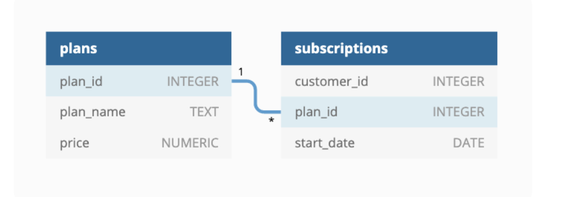

# 🥑 Case Study #3: Foodie-Fi
[](https://github.com/KarenSaraiMoralesMontiel/8-Week-SQL-Challenge/tree/main)
[](https://github.com/KarenSaraiMoralesMontiel/Portfolio)


***

## 📖 Table of Contents
1. [Bussiness Task](#bussiness-task)
2. [Entity Relationship Diagram](#entity-relationship-diagram)
3. [Solution](#solutions)
    - [A. Customer Journey](#a-customer-journey)
    - [B. Data Analysis Questions](#b-data-analysis-questions)
    - [C. Challenge Payment Question](#c-challenge-payment-question)
    - [D. Outside The Box Questions ](#d-outside-the-box-questions)

Please note that all the information regarding the case study has been sourced from the following link: [here](https://8weeksqlchallenge.com/case-study-3/).

## Bussiness Task
Subscription based businesses are super popular and Danny realised that there was a large gap in the market - he wanted to create a new streaming service that only had food related content - something like Netflix but with only cooking shows!

Danny finds a few smart friends to launch his new startup Foodie-Fi in 2020 and started selling monthly and annual subscriptions, giving their customers unlimited on-demand access to exclusive food videos from around the world!

## Entity Relationship Diagram


## Solution

## A. Customer Journey
[](#-table-of-contents)

<details>

Based off the 8 sample customers provided in the sample from the subscriptions table, write a brief description about each customer’s onboarding journey.

````sql
SELECT 
	  subscriptions.customer_id,
	  plans.plan_name,
	  plans.price,
	  subscriptions.start_date
FROM foodie_fi.subscriptions subscriptions
LEFT JOIN  foodie_fi.plans plans
USING (plan_id)
WHERE subscriptions.customer_id IN (1,2,11,13,15,16,18,19);
````

**Answer:**
| customer_id | plan_name | price | start_date |
| ----------- | --------- | ----- | ---------- |
|1	|trial	|0	|01/08/2020|
|1	|basic monthly	|9.9	|08/08/2020|
|2	|trial	|0	|20/09/2020|
|2	|pro annual	|199	|27/09/2020|
|11	|trial	|0	|19/11/2020|
|11	|churn	|NULL	|26/11/2020|
|13	|trial	|0	|15/12/2020|
|13	|basic monthly	|9.9	|22/12/2020|
|13	|pro monthly	|19.9	|29/03/2021|
|15	|trial	|0	|17/03/2020|
|15	|pro monthly	|19.9	|24/03/2020|
|15	|churn	|NULL	|29/04/2020|
|16	|trial	|0	|31/05/2020|
|16	|basic monthly	|9.9	|07/06/2020|
|16	|pro annual	|199	|21/10/2020|
|18	|trial	|0	|06/07/2020|
|18	|pro monthly	|19.9	|13/07/2020|
|19	|trial	|0	|22/06/2020|
|19	|pro monthly	|19.9	|29/06/2020|
|19	|pro annual	|199	|29/08/2020|


Let's start with customer 1! They started a trial plan on August 1, 2020 updated automatically to basic monthly plan a week after and has been on that plan ever since.

| customer_id | plan_name | price | start_date |
| ----------- | --------- | ----- | ---------- |
|1	|trial	|0	|01/08/2020|
|1	|basic monthly	|9.9	|08/08/2020|

Customer 15 started with a trial on March 31, 2020 and updated to pro monthy a week after but cancelled a month and five days later.

| customer_id | plan_name | price | start_date |
| ----------- | --------- | ----- | ---------- |
|15	|trial	|0	|17/03/2020|
|15	|pro monthly	|19.9	|24/03/2020|
|15	|churn	|NULL	|29/04/2020|

Customer 19 started with a trialplan on June 22, 2020,  upgraded it to a pro monthly plan a week after and two months later updated to a pro annual plan.

| customer_id | plan_name | price | start_date |
| ----------- | --------- | ----- | ---------- |
|19	|trial	|0	|22/06/2020|
|19	|pro monthly	|19.9	|29/06/2020|
|19	|pro annual	|199	|29/08/2020|

</details>

***

## B. Data Analysis Questions
[](#-table-of-contents)

<details>

### 1. How many customers has Foodie-Fi ever had?

````sql
SELECT COUNT(DISTINCT customer_id) total_customers
FROM foodie_fi.subscriptions;
````

**Answer:**
| total_customers |
| --------------- |
| 1000            |

***

### 2. What is the monthly distribution of trial plan start_date values for our dataset - use the start of the month as the group by value?

````sql
SELECT
  TO_CHAR(start_date, 'Month') AS trial_month,
  COUNT(DISTINCT customer_id) AS trial_total_customers
FROM foodie_fi.subscriptions
WHERE plan_id = 0
GROUP BY TO_CHAR(start_date, 'Month'), EXTRACT(MONTH FROM start_date)
ORDER BY EXTRACT(MONTH FROM start_date);
````

**Answer:**
|trial_month | trial_total_customers |
| ---------- | --------------------- | 
|January  	|88|
|February 	|68|
|March    	|94|
|April    	|81|
|May      	|88|
|June     	|79|
|July     	|89|
|August   	|88|
|September |	87|
|October  |	79|
|November |	75|
|December |	84|


***

### 3. What plan start_date values occur after the year 2020 for our dataset? Show the breakdown by count of events for each plan_name

````sql
SELECT
  plan_name,
  COUNT(DISTINCT customer_id) total_count_after_2020
FROM foodie_fi.subscriptions
LEFT JOIN foodie_fi.plans
USING (plan_id)
WHERE EXTRACT(YEAR FROM start_date) > 2020
GROUP BY plan_name;
````

**Answer:** 
|plan_name | total_count_after_2020 |
|basic monthly|	8 |
|churn|	71 |
|pro annual|	63 |
|pro monthly|	60 |

***

### 4. What is the customer count and percentage of customers who have churned rounded to 1 decimal place?

````sql
SELECT
  plan_name,
  COUNT(DISTINCT customer_id) churn_count,
  ROUND(100*COUNT(DISTINCT customer_id)::numeric/(
  SELECT COUNT(DISTINCT customer_id)
  FROM foodie_fi.subscriptions), 1) percentage
FROM foodie_fi.subscriptions
LEFT JOIN foodie_fi.plans
USING (plan_id)
WHERE plan_name = 'churn'
GROUP BY plan_name;
````

**Answer:**
| plan_name | churn_count | percentage |
| --------- | ----------- | ---------- |
| churn     | 307         | 30.7       |

***

### 5. How many customers have churned straight after their initial free trial - what percentage is this rounded to the nearest whole number?

````sql
WITH customer_plans_cte AS (
  SELECT 
    plan_name,
    customer_id,
    ROW_NUMBER() OVER (PARTITION BY customer_id ORDER BY start_date) AS movements_num
  FROM foodie_fi.subscriptions subscriptions
  LEFT JOIN foodie_fi.plans
	USING (plan_id)
)
SELECT 
	COUNT(CASE 
    WHEN movements_num = 2 AND plan_name = 'churn' THEN 1 
    ELSE 0 END) AS churned_customers,
	ROUND(100.0 * COUNT(
    CASE 
      WHEN movements_num = 2 AND plan_name = 'churn' THEN 1 
      ELSE 0 END) 
	  / (SELECT COUNT(DISTINCT customer_id) 
      FROM foodie_fi.subscriptions)
  ) AS churn_percentage FROM customer_plans_cte
WHERE plan_name = 'churn'
AND movements_num = 2;
````

**Answer:**
| churned_customers | churn_percentage |
| ----------------- | ---------------- |
| 92                | 9                |


***

### 6. What is the number and percentage of customer plans after their initial free trial?

````sql

````

**Answer:**


***

### 7. What is the customer count and percentage breakdown of all 5 plan_name values at 2020-12-31?

````sql

````

**Answer:**


***

### 8. How many customers have upgraded to an annual plan in 2020?

````sql

````

**Answer:**


***

### 9. How many days on average does it take for a customer to an annual plan from the day they join Foodie-Fi?

````sql

````

**Answer:**


***

### 10. Can you further breakdown this average value into 30 day periods (i.e. 0-30 days, 31-60 days etc)

````sql

````

**Answer:**


***

### 11. How many customers downgraded from a pro monthly to a basic monthly plan in 2020?

````sql

````

**Answer:**


</details>

***

## C. Challenge Payment Question
[](#-table-of-contents)

<details>

The Foodie-Fi team wants you to create a new payments table for the year 2020 that includes amounts paid by each customer in the subscriptions table with the following requirements:

    monthly payments always occur on the same day of month as the original start_date of any monthly paid plan
    upgrades from basic to monthly or pro plans are reduced by the current paid amount in that month and start immediately
    upgrades from pro monthly to pro annual are paid at the end of the current billing period and also starts at the end of the month period
    once a customer churns they will no longer make payments


````sql

````

**Answer:**


***


</details>

## D. Outside The Box Questions
[](#-table-of-contents)

The following are open ended questions which might be asked during a technical interview for this case study - there are no right or wrong answers, but answers that make sense from both a technical and a business perspective make an amazing impression!

<details>

### 1. How would you calculate the rate of growth for Foodie-Fi?

````sql

````

**Answer:**


### 2. What key metrics would you recommend Foodie-Fi management to track over time to assess performance of their overall business?

````sql

````

**Answer:**


### 3. What are some key customer journeys or experiences that you would analyse further to improve customer retention?

````sql

````

**Answer:**


### 4. If the Foodie-Fi team were to create an exit survey shown to customers who wish to cancel their subscription, what questions would you include in the survey?

````sql

````

**Answer:**


### 5. What business levers could the Foodie-Fi team use to reduce the customer churn rate? How would you validate the effectiveness of your ideas?

````sql

````

**Answer:**


</details>

