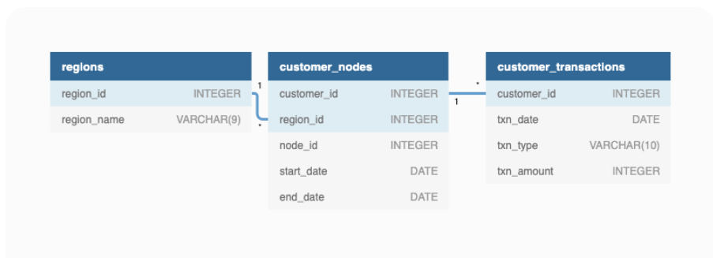

# 💰 Case Study #4: Data Bank
[](https://github.com/KarenSaraiMoralesMontiel/8-Week-SQL-Challenge/tree/main)
[](https://github.com/KarenSaraiMoralesMontiel/Portfolio)


***

## 📖 Table of Contents
1. [Bussiness Task](#bussiness-task)
2. [Entity Relationship Diagram](#entity-relationship-diagram)
3. [Solutions](#solutions)

Please note that all the information regarding the case study has been sourced from the following link: [here](https://8weeksqlchallenge.com/case-study-4/).

## Bussiness Task
anny thought that there should be some sort of intersection between these new age banks, cryptocurrency and the data world…so he decides to launch a new initiative - Data Bank!

Data Bank runs just like any other digital bank - but it isn’t only for banking activities, they also have the world’s most secure distributed data storage platform!

Customers are allocated cloud data storage limits which are directly linked to how much money they have in their accounts. There are a few interesting caveats that go with this business model, and this is where the Data Bank team need your help!

## Entity Relationship Diagram


## Solutions

## A. Customer Nodes Exploration

### 1. How many unique nodes are there on the Data Bank system?

````sql
SELECT COUNT(DISTINCT node_id) unique_nodes
FROM data_bank.customer_nodes;
````

**Answer:**
| unique_nodes |
| ------------ |
| 5            |

- There are 5 unique nodes of all branches.

### 2. What is the number of nodes per region?

````sql
SELECT regions.region_name, 
COUNT(DISTINCT customer_nodes.node_id) unique_nodes
FROM data_bank.regions regions
JOIN data_bank.customer_nodes customer_nodes
	ON regions.region_id = customer_nodes.region_id
GROUP BY regions.region_name;
````

**Answer:**
| region_name  | unique_nodes |
| ------------ | ------------ |
| Africa       | 5            |
| America      | 5            |
| Asia         | 5            |
| Australia    | 5            |
| Europe       | 5            |

- All regions have the same number of unique nodes. Very interesting!

### 3. How many customers are allocated to each region?

````sql
SELECT regions.region_name, 
COUNT(customer_nodes.customer_id) customers_count
FROM data_bank.regions regions
JOIN data_bank.customer_nodes customer_nodes
	ON regions.region_id = customer_nodes.region_id
GROUP BY regions.region_name
ORDER BY customers_count DESC;
````

**Answer:**
| region_name  | unique_nodes |
| ------------ | ------------ |
| Australia    | 770          |
| America      | 735          |
| Africa       | 714          |
| Asia         | 665          |
| Europe       | 616          |

### 4. How many days on average are customers reallocated to a different node?

````sql
WITH customerDates AS (
  SELECT 
    customer_id,
    region_id,
    node_id,
    MIN(start_date) AS first_date
  FROM data_bank.customer_nodes
  GROUP BY customer_id, region_id, node_id
),
reallocation AS (
  SELECT
    customer_id,
    node_id,
    region_id,
    first_date,
    (LEAD(first_date) OVER(PARTITION BY customer_id 
                           ORDER BY first_date) - first_date) AS moving_days
  FROM customerDates
)
SELECT 
  ROUND(AVG(moving_days)) AS avg_moving_days
FROM reallocation;

````

**Answer:**
| avg_moving_days |
| --------------- |
| 24              |

### 5. What is the median, 80th and 95th percentile for this same reallocation days metric for each region?

````sql
WITH customerDates AS (
  SELECT 
    customer_id,
    region_id,
    node_id,
    MIN(start_date) AS first_date
  FROM data_bank.customer_nodes
  GROUP BY customer_id, region_id, node_id
),
reallocation AS (
  SELECT
    customer_id,
    node_id,
    region_id,
    first_date,
    (LEAD(first_date) OVER(PARTITION BY customer_id 
                           ORDER BY first_date) - first_date) AS moving_days
  FROM customerDates
)
SELECT 
  r.region_id,
  rg.region_name,
  ROUND((PERCENTILE_CONT(0.5) WITHIN GROUP (ORDER BY r.moving_days))::NUMERIC, 2) AS median,
  ROUND((PERCENTILE_CONT(0.8) WITHIN GROUP (ORDER BY r.moving_days))::NUMERIC, 2) AS percentile_80,
  ROUND((PERCENTILE_CONT(0.95) WITHIN GROUP (ORDER BY r.moving_days))::NUMERIC, 2) AS percentile_95
FROM reallocation r
JOIN data_bank.regions rg ON r.region_id = rg.region_id
WHERE r.moving_days IS NOT NULL
GROUP BY r.region_id, rg.region_name;
````

**Answer:**
| region_id | region_name |median  |percentile_80 |percentile_95|
| --------- | ----------- | ------ | ------------ | ----------- |
|1      	| Australia   |22.00   |	31.00     |	54.00       |
|2      	| America     |21.00   |	33.20     |	57.00       |
|3      	| Africa 	  |21.00   |	33.20     |	58.80       |
|4      	| Asia 	      |22.00   |    32.40     |	49.85       |
|5      	| Europe 	  |22.00   |    31.00     |	54.30       |

***

## B. Customer Transactions

### 1. What is the unique count and total amount for each transaction type?

````sql
SELECT txn_type,
	   COUNT(txn_type) txn_type_count,
       SUM(txn_amount) total_amount
FROM data_bank.customer_transactions
GROUP BY txn_type;
````

**Answer:**
|txn_type 	|txn_type_count | total_amount |
| --------- | ------------- | ------------ |
|purchase 	|1617 	        | 806537       |
|deposit 	|2671 	        | 1359168      |
|withdrawal |1580 	        | 793003       |

### 2. What is the average total historical deposit counts and amounts for all customers?

````sql
WITH historical_data as (
  SELECT customer_id,
		COUNT(txn_date) num_deposits,
        SUM(txn_amount) total_sum
  FROM data_bank.customer_transactions
  WHERE txn_type = 'deposit'
  GROUP BY customer_id)
SELECT ROUND(AVG(num_deposits)) avg_no_deposits,
ROUND(AVG(total_sum)::NUMERIC,3) avg_deposit
FROM historical_data;
````

**Answer:**
|avg_no_deposits | avg_deposit |
| -------------- | ----------- |
|5               | 2718.336    |

### 3. For each month - how many Data Bank customers make more than 1 deposit and either 1 purchase or 1 withdrawal in a single month?

````sql
WITH month_year_transactions as (
  SELECT
	customer_id,
	TO_CHAR(txn_date, 'mm-yyyy') month_year,
  	SUM(CASE WHEN txn_type = 'deposit' THEN 1 ELSE 0 END) deposit_count,
  	SUM(CASE WHEN txn_type = 'purchase' THEN 1 ELSE 0 END) purchase_count,
    SUM(CASE WHEN txn_type = 'withdrawal' THEN 1 ELSE 0 END) withdrawal_count
  FROM data_bank.customer_transactions
  GROUP BY customer_id, TO_CHAR(txn_date, 'mm-yyyy')
)
SELECT
  TO_CHAR(TO_DATE(month_year, 'MM-YYYY'), 'Mon-YYYY') AS month_year,
  COUNT(DISTINCT customer_id) AS customer_count
FROM month_year_transactions
WHERE deposit_count > 1 
  AND (purchase_count = 1 OR withdrawal_count = 1)
GROUP BY TO_DATE(month_year, 'MM-YYYY')
ORDER BY TO_DATE(month_year, 'MM-YYYY'); 
````

**Answer:**
| month_year | customer_count |
| ---------- | -------------- |
| Jan-2020   | 	115           |
| Feb-2020   | 	108           |
| Mar-2020   | 	113           |
| Apr-2020   | 	50            |

### 4. What is the closing balance for each customer at the end of the month?

````sql
WITH all_months AS (
  -- Generate a series of months between the earliest and latest transaction date
  SELECT customer_id, 
         TO_CHAR(generate_series(MIN(txn_date), (MAX(txn_date) + INTERVAL '1 month'), '1 month'), 'MM-YYYY') AS month_year
  FROM data_bank.customer_transactions
  GROUP BY customer_id
),
month_year_transactions AS (
  -- Combine the actual transactions and the months with no transactions
  SELECT 
  customer_id, 
  month_year,
  SUM(deposit_amount) AS deposit_amount,
  SUM(purchase_amount) AS purchase_amount,
  SUM(withdrawal_amount) AS withdrawal_amount
FROM (
  SELECT
    customer_id,
    TO_CHAR(txn_date, 'MM-YYYY') AS month_year,
    SUM(CASE WHEN txn_type = 'deposit' THEN txn_amount ELSE 0 END) AS deposit_amount,
    SUM(CASE WHEN txn_type = 'purchase' THEN txn_amount ELSE 0 END) AS purchase_amount,
    SUM(CASE WHEN txn_type = 'withdrawal' THEN txn_amount ELSE 0 END) AS withdrawal_amount
  FROM data_bank.customer_transactions
  GROUP BY customer_id, TO_CHAR(txn_date, 'MM-YYYY')

  UNION ALL

  -- Add zero-amount rows for months with no transactions
  SELECT
    customer_id,
    month_year,
    0 AS deposit_amount,
    0 AS purchase_amount,
    0 AS withdrawal_amount
  FROM all_months ) combine
  GROUP BY customer_id, month_year
  ORDER BY customer_id, month_year
),
transactions AS (
  SELECT 
      customer_id,
      month_year,
      deposit_amount - (purchase_amount + withdrawal_amount) AS transactions
  FROM 
      month_year_transactions
)
SELECT 
    customer_id,
    month_year,
    transactions,
    COALESCE(SUM(transactions) OVER (PARTITION BY customer_id ORDER BY month_year ROWS BETWEEN UNBOUNDED PRECEDING AND CURRENT ROW), 0) AS running_balance
FROM 
    transactions
ORDER BY 
    customer_id,
    month_year;
````

**Answer:**
|customer_id | month_year | transactions | running_balance |
| ---------- | ---------- | ------------ | --------------- |
|1 	|01-2020 	|312 	|312|
|1 	|02-2020 	|0 	|312|
|1 	|03-2020 	|-952 	|-640|
|1 	|04-2020 	|0 	|-640|
|2 	|01-2020 	|549 	|549|
|2 	|02-2020 	|0 	|549|
|2 	|03-2020 	|61 	|610|
|2 	|04-2020 	|0 	|610|
|3 	|01-2020 	|144 	|144|
|3 	|02-2020 	|-965 	|-821|
|3 	|03-2020 	|-401 	|-1222|
|3 	|04-2020 	|493 	|-729|
|4 	|01-2020 	|848 	|848|
|4 	|02-2020 	|0 	|848|
|4 	|03-2020 	|-193 	|655|
|4 	|04-2020 	|0 	|655|

### 5. What is the percentage of customers who increase their closing balance by more than 5%?

````sql

````

**Answer:**


***

## C. Data Allocation Challenge

To test out a few different hypotheses - the Data Bank team wants to run an experiment where different groups of customers would be allocated data using 3 different options:

- Option 1: data is allocated based off the amount of money at the end of the previous month
- Option 2: data is allocated on the average amount of money kept in the account in the previous 30 days
- Option 3: data is updated real-time

For this multi-part challenge question - you have been requested to generate the following data elements to help the Data Bank team estimate how much data will need to be provisioned for each option:

- running customer balance column that includes the impact each transaction
- customer balance at the end of each month
- minimum, average and maximum values of the running balance for each customer

Using all of the data available - how much data would have been required for each option on a monthly basis?

***

### D. Extra Challenge

Data Bank wants to try another option which is a bit more difficult to implement - they want to calculate data growth using an interest calculation, just like in a traditional savings account you might have with a bank.

If the annual interest rate is set at 6% and the Data Bank team wants to reward its customers by increasing their data allocation based off the interest calculated on a daily basis at the end of each day, how much data would be required for this option on a monthly basis?

Special notes:

    Data Bank wants an initial calculation which does not allow for compounding interest, however they may also be interested in a daily compounding interest calculation so you can try to perform this calculation if you have the stamina!
